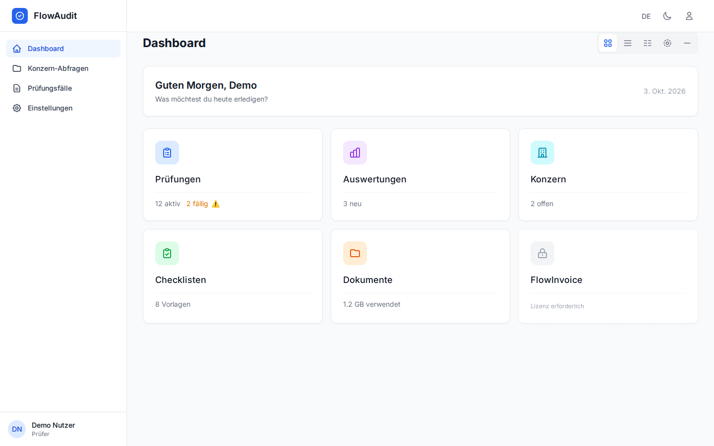
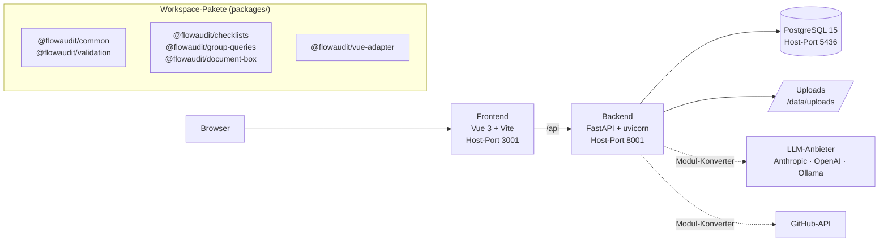

# FlowNavigator

[](https://github.com/janpow77/flownavigator/actions/workflows/ci.yml)


**Modulare Management-Plattform für Prüfbehörden im EU-Strukturfondsbereich (EFRE): Prüfungsfälle, Checklisten, Feststellungen und Belege an einem Ort, mandantenfähig über eine Vendor-, Kunden- und Behördenebene.**

Die Anwendung firmiert in der Oberfläche und in der API als „FlowAudit“. Sie besteht aus einem FastAPI-Backend, einem Vue-3-Frontend und gemeinsamen TypeScript-Paketen in einem pnpm/Turborepo-Monorepo.

<picture>
  <source media="(prefers-color-scheme: dark)" srcset="docs/assets/dashboard-dark.png">
  
</picture>

<sub>Dashboard in der Kachelansicht. Die Kennzahlen auf den Kacheln sind im Frontend fest hinterlegte Platzhalter.</sub>

## Auf einen Blick

- **Prüfungsfälle** (Vorhabenprüfungen) anlegen, filtern und mit Statistik auswerten; je Fall Checklisten, Feststellungen, Belegkasten und Änderungshistorie.
- **Checklisten** aus Vorlagen erzeugen (Standardvorlagen für Hauptcheckliste und Vergabe) und je Prüfungsfall ausfüllen.
- **Feststellungen** erfassen, bestätigen und als erledigt markieren, mit Zusammenfassung je Fall.
- **Belegkasten** mit Datei-Upload und Download je Prüfungsfall (u. a. PDF, Bilder, Office-Dateien, bis 50 MB).
- **Mehrschichtiges Mandantenmodell**: Vendor (Betreiber) verwaltet Kunden (Coordination Bodies), Lizenzen und Modul-Auslieferungen; Kunden und Behörden pflegen eigene Profile (siehe [Layer-Struktur](docs/LAYER-STRUKTUR.md)).
- **Modul-Konverter** als Fünf-Schritt-Assistent: Modulvorlage wählen, LLM-Anbieter konfigurieren (Anthropic, OpenAI, Ollama), GitHub-Repository anbinden, prüfen, ausführen.

Die Oberfläche ist zweisprachig (Deutsch/Englisch), hat einen hellen und dunklen Modus und mehrere Dashboard-Ansichten (Kacheln, Liste, Baum, Radial, Minimal).

## Architektur



| Verzeichnis | Inhalt |
|---|---|
| `apps/backend/` | FastAPI-App (`app/main.py`), Router in `app/api/`, SQLAlchemy-Modelle, Alembic-Migrationen `001`–`009`, pytest-Tests |
| `apps/frontend/` | Vue-3-App mit Pinia, vue-router, vue-i18n und Tailwind CSS |
| `packages/` | gemeinsame TypeScript-Pakete, gebaut mit tsup |
| `scripts/` | Backup, Wiederherstellung, Startprüfung |
| `docs/` | Layer-Struktur, Deployment, EFRE-Methodikunterlagen |

## Schnellstart

Voraussetzungen: Docker mit Compose-Plugin. Für die Entwicklung ohne Docker zusätzlich Node.js ≥ 20 mit pnpm und Python ≥ 3.11.

```bash
git clone https://github.com/janpow77/flownavigator.git
cd flownavigator
docker compose up -d
```

Danach erreichbar:

| Dienst | Adresse |
|---|---|
| Frontend | http://localhost:3001 |
| API-Dokumentation (Swagger) | http://localhost:8001/api/docs |
| Gesundheitsprüfung inkl. Datenbank | http://localhost:8001/api/health |
| PostgreSQL | `localhost:5436` (DB, Benutzer `flowaudit`) |

Beim Start legt das Backend die Tabellen selbst an (`Base.metadata.create_all`). Das Compose-Setup läuft im Entwicklungsmodus (`DEBUG=true`, Entwicklungsschlüssel) und ist nicht für den Produktivbetrieb gedacht.

<!-- TODO: Es gibt kein Seed-Skript für den ersten Mandanten und Benutzer. POST /api/auth/register verlangt eine bestehende tenant_id; den Weg zum ersten Login hier dokumentieren. -->

<details>
<summary><b>Entwicklung ohne Docker</b></summary>

Backend (`apps/backend`), mit einer laufenden PostgreSQL-Instanz:

```bash
cd apps/backend
cp .env.example .env              # DATABASE_URL anpassen
pip install -e ".[dev]"           # oder: pip install -r requirements.txt
alembic upgrade head              # Migrationen 001..009
uvicorn app.main:app --reload --port 8000
```

Frontend (`apps/frontend`). Der Vite-Dev-Server lauscht auf Port 5173 und leitet `/api` an `http://localhost:8001` weiter (`vite.config.ts`). Wer das Backend lokal auf Port 8000 startet, muss den Proxy anpassen.

```bash
pnpm install
pnpm --filter @flowaudit/frontend dev
```

Befehle im Monorepo-Wurzelverzeichnis (Turborepo):

```bash
pnpm build        # alle Pakete und Apps bauen
pnpm lint
pnpm typecheck
pnpm test         # Vitest (Frontend) über turbo
pnpm format       # Prettier
```

Backend-Prüfungen:

```bash
cd apps/backend
pytest                              # asyncio_mode = auto
ruff check . && black --check . && mypy app
```

</details>

<details>
<summary><b>Konfiguration (Umgebungsvariablen des Backends)</b></summary>

Geladen über pydantic-settings aus der Umgebung bzw. `.env` (`apps/backend/app/core/config.py`, Vorlage `apps/backend/.env.example`):

| Variable | Bedeutung | Standard |
|---|---|---|
| `DATABASE_URL` | PostgreSQL-DSN (`postgresql+asyncpg://…`) | Pflicht |
| `SECRET_KEY` | Schlüssel für JWT (HS256) | Entwicklungsschlüssel; bei `DEBUG=false` bricht der Start damit ab |
| `DEBUG` | Entwicklungsmodus | `false` |
| `API_PREFIX` | Präfix aller API-Routen | `/api` |
| `ACCESS_TOKEN_EXPIRE_MINUTES` | Gültigkeit des Zugangstokens | `1440` |
| `CORS_ORIGINS` | erlaubte Origins (JSON-Liste) | `["http://localhost:5173","http://localhost:3000"]` |
| `UPLOAD_DIR` | Ablage für Belegkasten-Uploads | `/data/uploads` |
| `MAX_UPLOAD_SIZE` | maximale Dateigröße in Byte | `52428800` (50 MB) |

Sicheren Schlüssel erzeugen:

```bash
python3 -c "import secrets; print(secrets.token_urlsafe(32))"
```

</details>

<details>
<summary><b>API-Überblick</b></summary>

Alle Routen liegen unter `/api`; die vollständige Beschreibung liefert `/api/docs` bzw. `/api/openapi.json`.

| Bereich | Pfad |
|---|---|
| Anmeldung | `/api/auth/login`, `/api/auth/register`, `/api/auth/me` |
| Prüfungsfälle | `/api/audit-cases`, `/api/audit-cases/statistics` |
| Feststellungen | `/api/audit-cases/{case_id}/findings` |
| Belegkasten | `/api/audit-cases/{case_id}/documents` |
| Änderungshistorie | `/api/audit-cases/{case_id}/history` |
| Checklisten | `/api/checklists/templates`, `/api/checklists/audit-case/{case_id}` |
| Benutzereinstellungen | `/api/preferences` |
| Modul-Konverter | `/api/modules/llm-config`, `/api/modules/module-templates`, `/api/modules/conversions`, `/api/modules/github-integrations` |
| Vendor (Layer 0) | `/api/v1/vendor`, `/api/v1/customers`, `/api/v1/modules` |
| Profile (Layer 1/2) | `/api/v1/tenants/{tenant_id}/profile`, `/api/v1/authorities/{tenant_id}/profile` |
| Layer-Dashboard | `/api/v1/dashboard/layers`, `/api/v1/dashboard/my-dashboard` |
| Workflow-Historie | `/api/v1/history/events`, `/api/v1/history/conversations` |
| Gesundheit | `/health`, `/api/health` |

</details>

<details>
<summary><b>Betrieb, Backup und CI</b></summary>

- Produktions-Images: `apps/backend/Dockerfile` (Python 3.11, uvicorn auf Port 8000) und `apps/frontend/Dockerfile` (Build mit pnpm, Auslieferung über nginx).
- Hinweise zu Deployment, Backup und Wiederherstellung: [docs/DEPLOYMENT.md](docs/DEPLOYMENT.md), [README_DEPLOYMENT.md](README_DEPLOYMENT.md), [BACKUP_RECOVERY.md](BACKUP_RECOVERY.md); Skripte `scripts/backup.sh`, `scripts/restore.sh`, `scripts/startup-check.sh`.
- `docker compose down -v` löscht das Datenbank-Volume `flownavigator_postgres_data`.
- Die Pipeline [`.github/workflows/ci.yml`](.github/workflows/ci.yml) (Backend-Tests gegen PostgreSQL, Lint, Frontend-Build, Docker-Build, Abhängigkeits- und Secret-Scan) wird nur manuell ausgelöst (`workflow_dispatch`).

</details>

## Dokumentation

- [docs/LAYER-STRUKTUR.md](docs/LAYER-STRUKTUR.md): Ebenen, Rollen und Datenmodell (Vendor, Coordination Body, Behörde)
- [ARCHITEKTUR.md](ARCHITEKTUR.md): automatisch erzeugte Modulkarte aus dem Code-Graphen
- [COMPLIANCE_REPORT_1060_2021.md](COMPLIANCE_REPORT_1060_2021.md): Abgleich des Funktionsumfangs mit der VO (EU) 2021/1060
- [docs/DEPLOYMENT.md](docs/DEPLOYMENT.md): Deployment-Anleitung
- `docs/` enthält außerdem EFRE-Methodikunterlagen (Prüfstrategie, Checklisten, Methodological Note der Kommission) als PDF/DOCX/XLSX.
- [CLAUDE.md](CLAUDE.md): Arbeitskontext für KI-Assistenten (Stack, Befehle, Konventionen)

## Mitwirkung

Änderungen bitte als Pull Request. Vorher `pnpm lint`, `pnpm typecheck`, `pnpm test` und im Backend `pytest` sowie `ruff check .` ausführen. Code-Stil: Prettier (`.prettierrc`) im Frontend, black/ruff mit Zeilenlänge 88 im Backend.

## Lizenz

<!-- TODO: Im Repository liegt keine LICENSE-Datei. Lizenz festlegen und hier nennen. -->
Für dieses Repository ist bislang keine Lizenz hinterlegt.
